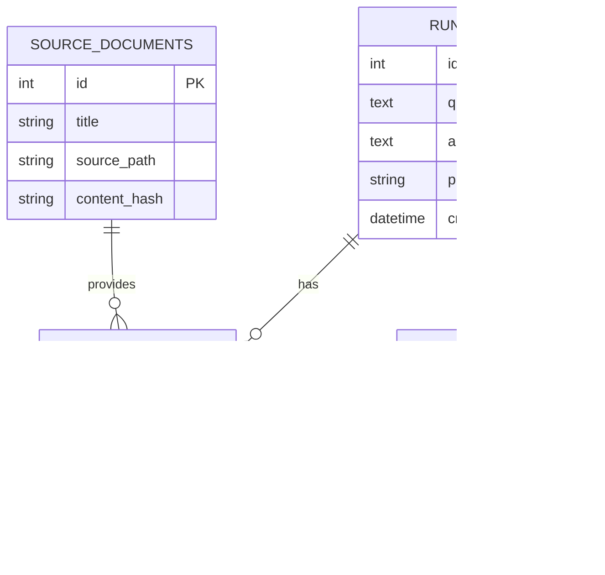

# ER Diagram

```mermaid
erDiagram
  RUN_LOGS ||--o{ RETRIEVED_CHUNKS : has
  RUN_LOGS ||--o{ TIMELINE_STEPS : records
  SOURCE_DOCUMENTS ||--o{ RETRIEVED_CHUNKS : provides
  RUN_LOGS {
int id PK
text question
text answer
string project_type
datetime created_at
  }
  SOURCE_DOCUMENTS {
int id PK
string title
string source_path
string content_hash
  }
  RETRIEVED_CHUNKS {
int id PK
int run_log_id FK
int document_id FK
text chunk_text
float score
  }
  TIMELINE_STEPS {
int id PK
int run_log_id FK
string step_name
string status
text message
  }
```

The ER model supports interview-friendly explainability: each run has retrieved evidence and timeline steps, while source documents remain reusable across runs.
