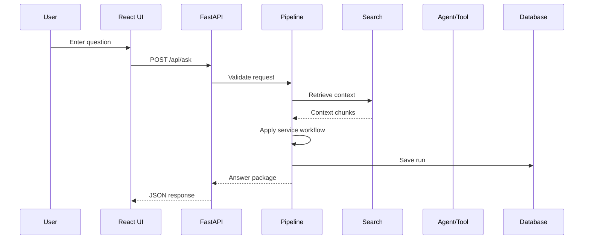
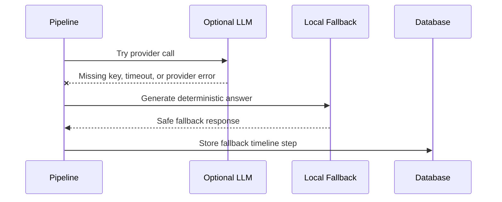

# Sequence Diagrams

## Main Project Workflow

```mermaid
sequenceDiagram
  participant U as User
  participant UI as React UI
  participant API as FastAPI
  participant P as Pipeline
  participant S as Search
  participant A as Agent/Tool
  participant DB as Database
  U->>UI: Enter question
  UI->>API: POST /api/ask
  API->>P: Validate request
  P->>S: Retrieve context
  S-->>P: Context chunks
  P->>P: Apply service workflow
  P->>DB: Save run
  P-->>API: Answer package
  API-->>UI: JSON response
```

## Error/Fallback Flow

```mermaid
sequenceDiagram
  participant P as Pipeline
  participant L as Optional LLM
  participant F as Local Fallback
  participant DB as Database
  P->>L: Try provider call
  L--xP: Missing key, timeout, or provider error
  P->>F: Generate deterministic answer
  F-->>P: Safe fallback response
  P->>DB: Store fallback timeline step
```
